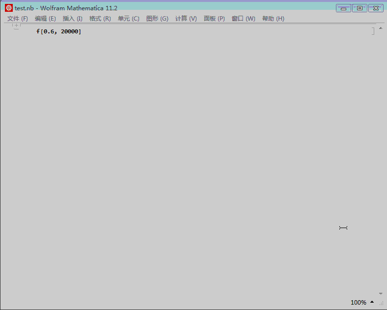

**Wolfram Workbench 3.0 + Wolfram Mathematica 11.2环境的搭建**

*准备*

- Win7 64位
- Mathematica 11.2
- [Java Development Kit (JDK) 8](http://www.oracle.com/technetwork/java/javase/downloads/index.html)  

* [Eclipse 4.6 (Neon)](https://eclipse.org/downloads/) 
* WorkbenchUpdate_10.1.822.zip for Eclipse

*安装*

- 安装jdk，得到jre文件夹
- 安装eclipse，若是zip版则解压eclipse并将jre文件夹拷到安装目录下
- 安装eclipse插件workbenchupdate_10.1.822.zip
- 安装mathematica 11.2
- 优化eclipse并关联mathematica 11.2

*使用*

- 建立wolfram basic project
- *.m文件写入函数

~~~mathematica
f[x_,n_] :=
    Module[ {k = 500},
        (*随机数生成*)
        y = Accumulate[RandomChoice[{-1, 1}, n]];
        (*添加序号*)
        data = Table[{i, y[[i]]}, {i, n}];
        (*动态画图*)
        Animate[ListPlot[data[[i;;i+k]], 
            Joined -> True, 
            Filling -> Bottom, 
            PlotLabel -> "The Max Value is 【" <> ToString[Max[data[[i;;i+k, 2]]]] <> (*输出期间最大值*)
            "】 At The Time " <> ToString[Position[data[[i;;i+k, 2]], Max[data[[i;;i+k, 2]]]] + data[[i, 1]]]], (*最大值对应的时间点*)
			{i, k+1, n-k, 1},
            AnimationRate -> 5,
            AppearanceElements -> None]
    ]
~~~

- *.nb文件使用wolfram language source editor打开并写入测试代码

~~~mathematica
f[0.6, 20000]
~~~

- 结果

