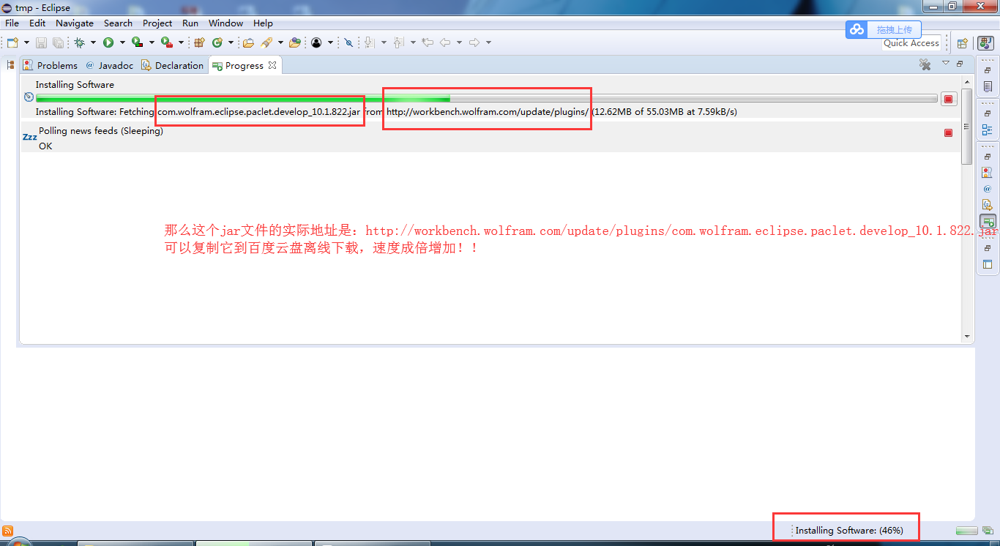

**Wolfram Workbench 3.0 + Wolfram Mathematica 11.2 环境的搭建**

- Win7 64位
- Mathematica 11.2
- [Java Development Kit (JDK) 8](http://www.oracle.com/technetwork/java/javase/downloads/index.html)  

* [Eclipse 4.6 (Neon)](https://eclipse.org/downloads/) 
* Workbench 10.1 for Eclipse

